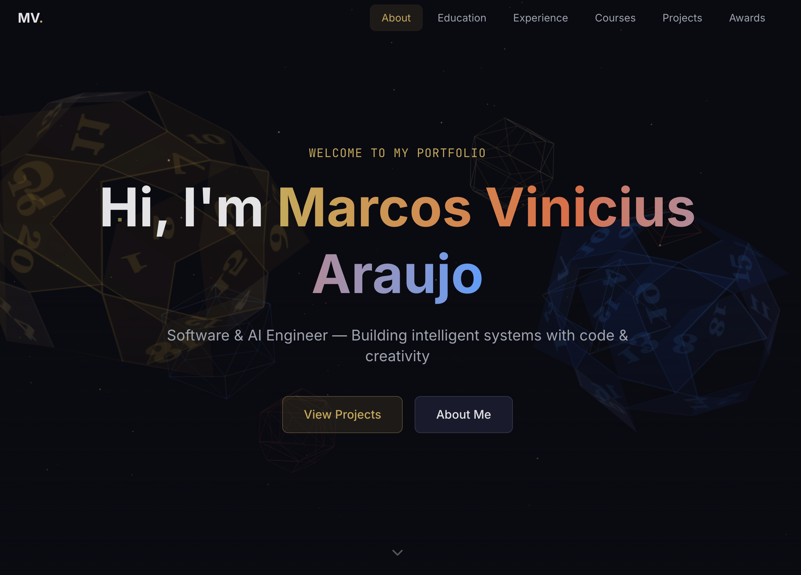

# Marcos Vinicius — Developer Portfolio

A modern, dark-themed developer portfolio built with **Next.js 16**, **Three.js**, and **Framer Motion**. Features interactive 3D crystal elements, smooth scroll animations, and a fantasy-inspired visual identity.



## Features

- **Interactive 3D Hero** — Floating crystals, D20 dice, and particle field rendered with React Three Fiber + Drei
- **Scroll Animations** — Cards and sections animate into view using Framer Motion with viewport-aware triggers
- **Responsive Design** — Fully responsive across mobile, tablet, and desktop breakpoints
- **Dark Theme** — Custom color system with gold, ember, and blue accent tones
- **Filterable Projects** — Filter project cards by technology tags with animated transitions
- **Experience Timeline** — Alternating left/right layout on desktop, stacked on mobile
- **Course Carousel** — Horizontally scrollable course cards with snap points
- **Glow Cards** — Reusable card component with hover glow effects and entrance animations

## Tech Stack

| Category | Technology |
|----------|-----------|
| Framework | [Next.js 16](https://nextjs.org/) (App Router, TypeScript) |
| Styling | [Tailwind CSS v4](https://tailwindcss.com/) |
| 3D | [React Three Fiber](https://r3f.docs.pmnd.rs/) + [Drei](https://drei.docs.pmnd.rs/) |
| Animation | [Framer Motion](https://motion.dev/) |
| Icons | [Lucide React](https://lucide.dev/) |
| Deployment | [Vercel](https://vercel.com/) |

## Getting Started

### Prerequisites

- Node.js 18+
- npm (or yarn/pnpm)

### Installation

```bash
git clone https://github.com/MarcosViniciusAraujo/portfolio.git
cd portfolio
npm install
```

### Development

```bash
npm run dev
```

Open [http://localhost:3000](http://localhost:3000).

### Production Build

```bash
npm run build
npm start
```

## Project Structure

```
src/
├── app/                # Next.js App Router (layout, page, globals.css)
├── components/
│   ├── layout/         # Navbar, Footer, Section, MobileMenu
│   ├── sections/       # HeroSection, AboutSection, TimelineSection,
│   │                   # EducationSection, CoursesSection, ProjectsSection,
│   │                   # AwardsSection
│   ├── three/          # HeroScene, FloatingCrystals, D20Dice, ParticleField
│   └── ui/             # Button, Badge, GlowCard, SectionHeading
├── data/               # Content data files (profile, projects, experience, etc.)
├── hooks/              # useScrollspy, useMediaQuery
├── lib/                # Utilities (cn) and constants
└── types/              # Shared TypeScript interfaces
```

## Customization

All content lives in `src/data/` — edit these files to make the portfolio your own.

### Adding a Project

Edit `src/data/projects.ts`:

```typescript
{
  id: "my-project",
  title: "My Project",
  description: "What it does",
  tags: ["React", "TypeScript"],
  year: 2026,
  featured: true,
  liveUrl: "https://...",
  repoUrl: "https://github.com/...",
  image: "/assets/projects/my-project.png",
}
```

Place project screenshots in `public/assets/projects/`.

### Adding Work Experience

Edit `src/data/experience.ts` and add an entry with `role`, `company`, `period`, `description`, `highlights`, and `technologies`.

### Updating Profile Info

Edit `src/data/profile.ts` to change your name, tagline, bio, location, socials, skills, and interests.

## Scripts

| Command | Description |
|---------|------------|
| `npm run dev` | Start development server |
| `npm run build` | Create production build |
| `npm start` | Serve production build |
| `npm run lint` | Run ESLint |

## Deployment

This project is optimized for [Vercel](https://vercel.com/). Import the repository and deploy with default settings — Vercel auto-detects Next.js.

## License

This project is private and not licensed for redistribution.
